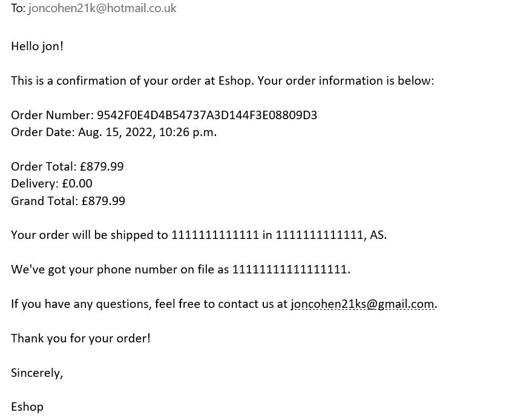

**_Eshop_**

WELCOME TO Eshop

Welcome to Eshop an online e-commerce store which server as your one stop shop for all your tech needs. There are plans to add products to our already growing inventory very soon. This online store was created using Django frameworks and PostgreSQL to manage the inventory database. The shop features a secure checkout payment with stripe payments which links in to the user profile and a complete order history included on the profile page. Eshop has many more features which will included down below.

<a href="https://eshopms4.herokuapp.com/" target="_blank" rel="noopner">Eshop</a>

# Contents

* [**User Experience UX**](<#user-experience-ux>)
   * [User Stories](<#user-stories>)
   * [**Wireframes**](<#wireframes>)
   * [**Design Choices**](<#design-choices>)
       * [Color Scheme](<#color-scheme>)
   * [**Features**](<#features>)
       * [Home](<#Home>)
       * [Products](<#Products>)
       * [Product_Details_Page](<#Product_Details_Page>)
       * [Shopping_Bag](<#Shopping_Bag>)
       * [Checkout_Page](<#Checkout_Page>)
       * [Profile](<#Profile>)
       * [Product_Management](<#Product_Management>)
       * [Order_Complete](<#Order_Complete>)
       * [Data Schema](<#Data-Schema>)
* [**Future Features**](<#future-features>)
* [**Technologies Used**](<#Technologies-Used>)
* [**Testing**](<#testing>)
* [**Deployment**](<#deployment>)
* [**Credits**](<#credits>)
* [**Content**](<#content>)
* [**Future Features**](<Future-Features>)
* [**Acknowledgements**](<#acknowledgements>)                

# User Experience (UX)

## User stories

 ### Motivation for creating an E-commerce store
 The main Motivation for creating an E-commerce store was, is that when shopping online for tech information I find it difficult to choose as there to many distractions and adverts on these sites trying to promote you to buy stuff. Eshop is a simple e-commerce store with best products on the market available for you!

 The target audience for this site are, people that tired of these big online stores, trying to sell you stuff you don’t want or stock they can’t sell. Eshop has the best products available to buy at best prices for people that don’t want to spend loads of money but still want the best tech on the market today. 

 Eshop was designed with security in mind. From the secure checkout, and to pages that have restricted access for the users to keep their information safe, such as the wish list and user profile including delivery information and a complete order history available so why not shop today. Below i have included statistics to justify my reasoning for picking an ecommerce store as my final project.
 

 <!-- Online Shopping vs In-Store Shopping in 2022-https://fashiondiscounts.uk/statistics-on-online-shopping-vs-in-store-shopping/ -->
* [Online Shopping vs In-Store Shopping](https://fashiondiscounts.uk/statistics-on-online-shopping-vs-in-store-shopping/)

Ecommerce has been growing at a remarkable pace for the last ten years, primarily due to its convenience. Its popularity simply exploded during the lockdown in 2020, as it presented shoppers with a safe alternative to visiting physical stores.

UK online retail sales have more than tripled in the last ten years.

Ecommerce in the UK grew 46.5% in 2020.29.6% of UK consumer spending is expected to shift to online purchases permanently.

55% of UK shoppers will continue to use primarily online channels after the pandemic.

80% of global consumers feel comfortable with returning to physical stores.

35% of shoppers browse online stores for fashion inspiration at least once a week.

 In-store and mobile commerce are the two most popular shopping channels.

Additionally, websites often have more exclusive sales and discounts than in physical stores, and you may be able to find products that were not discounted in-store available online for a much cheaper price. You are then able to pick these products up from your local store or get them delivered to your house.

 ### First time Visitor Goals 
1. All available products in separate categories  
2. All products have detailed description 
3. The amount of products displayed on the page
4. Easy user interface 
5. Search bar 
6. Order conformation
7. Secure site with card payment
8. User profile with order history. 

 ### Returning Visitor Goals   
1. Login and registration features available
2. Password recovery  
3. Images and text have links to the product description
4. Order history 
5. A feature to save personal information and delivery information 
6. Be able to save future purchase to your profile 
 
 ### Admin Privileges  
1. Be able to add product easily without editing the source code  
2. Product form to edit and delete product inventory. 
3. Be able to add new products to the product database easily and quickly
4. Be able to add to staff to the database with admin access
5. Admin access to view all customers that use Eshop

# Wireframes
The wire-frames for ‘Eshop’ were produced in[Balsamiq](https://balsamiq.com).
There are frames for a full width display ( 1920 x 1080 package)and a small mobile 
device (360 x 640). The final site varies slightly from the wire-frames due to bugs and design 
changes during development that occurred during the creation process. Mobile wire-frames haven`t been included due to the use of  bootstrap4 and django frameworks this
includes integrated responsiveness package.

[Contents](<#contents>)

# Design Choices
 When i was designing the Eshop e-commerce store I wanted it to be to be simple to use for the user with a simple nave bar with a dropdown menu which contains all the different categories and products the online store has to offer. Once again the time frame for this project was very tight so i used bootstrap 4 to create a lot features the site has to offer. I choose a purple and white as the main colors for the site with red only serving as warning color. Django Allauth and crispy forms where also used in the creation of the online store for the security of the site and design of the forms. 

 On the products page I have chosen to put the product cards in rows of 4 with a purple border, surrounding the card. Inside the card I have put edit and delete buttons with a category tag and a price and a brief description of the product, this has been done to mainly have the users focus to be on the products themselves, due to user feedback I included links to the product detail page on the descriptions. 

 
 
 THe colors that where chosen  are displayed in image above.

 Purple #37168a was used for border and text.

 red  #ff0000 was used for warnings and buttons. 
 
 White was used for a few various things backgrounds and text, flash messages and text.

  

[Contents](<#contents>)

# Features
### Home 
The home page features a nav bar with dropdown menu so the user can select the different categories available this covers all pages of the online store. Included at the top of the page is a search bar and in the top right is a profile menu and a shopping bag. Below that there is an image and a button that takes you through to the online store all products page. 

### Products Pages
All the product pages have the same designs which includes a simple border and a picture and product information on them.

### Product Details Page
This page contains an image of the product with a more detailed description of the item. Below that information is the price wishlist link so user can items to their wishlist

### shopping Bag
The checkout page features information on what you are about to purchases.

### Checkout Page 
The checkout page features your basic information you would expect to find on a checkout. The from covers everything form you your name to your address and card details.

### Profile
The profile pages displays the use login details in a form with delivery information and recent order history purchases. 
the login and register page are very Similar the only differences are the text on the pages. The login and register pages are very simple in there design. 

### Product management
There are two ways admin and staff can edit product information either on the Django admin page or on the product management page. 

### Order Complete
Conformation once an order has been completed are shown in the image below.

### Django Allauth
Most existing Django apps that address the problem of social authentication focus on just that. You typically need to integrate another app in order to support authentication via a local account.

This approach separates the worlds of local and social authentication. However, there are common scenarios to be dealt with in both worlds. For example, an e-mail address passed along by an OpenID provider is not guaranteed to be verified. So, before hooking an OpenID account up to a local account the e-mail address must be verified. So, e-mail verification needs to be present in both worlds.

Integrating both worlds is quite a tedious process. It is definitely not a matter of simply adding one social authentication app, and one local account registration app to your INSTALLED_APPS list.

This is the reason this project got started – to offer a fully integrated authentication app that allows for both local and social authentication, with flows that just work.

Commercial Support
* [Django_Allauth](https://pypi.org/project/django-allauth/)

#### Data Schema 

Above is the data schema for the relational database in the Eshop Models.

For the the relationship between the products and the wishlist, this is a one to many relationship meaning many products can go into 1 wishlist. This is also the same between the products and categories, as many products can go into one category.

This diagram also shows that per order only 1 order number is assigned showing a 1 to 1 relationship.
What this diagram describes is that the relationship between the profile and wishlist is a 1 to 1 relationship meaning for each profile you can create 1 wishlist. 

Also this shows that the checkout is updated by using the order Line item model as a 1 to 1 relationship. This is also the case for the relationship between the profile and user model.

[Contents](<#contents>)

## Deployment

  ### **Deployment**

 This project was deployed to heroku and the steps to do this are below:

1. sign up and log into heroku
2. In the top right hand corner of the heroku website click new, then create new app
3. Name app and select region
4. click create app
5. Install postgres under the resources tab
6. Insert relevant config vars into heroku, such as IP,PORT,SECRET_KEY, DATABASE_URL
7. You can click connect to github but this project used the CLI method.
8. Log into heroku via CLI
9. Create a git remote for heroku
10. Push all changes to the staging area
11. Push to heroku for your app to run and function.

### AWS
1. Buckets are used to store files for your live site.
2. On dashboard, search and open S3
3. In Amazon s3:
3. Create a new bucket
4. Fill in details
5. Uncheck block all public access
6. Check Acknowledge bucket will be public
7. Click Create bucket
8. In your new bucket
9. On Properties tab
10. Select Static website hosting
10. Check Use this bucket to host a website and fill in default values then click 'Save'
11. On 'Permissions' tab:
12. Go to 'CORS configuration' section and paste: [{ "AllowedHeaders": ["Authorization"],"AllowedMethods": ["GET"],"AllowedOrigins": ["*"],"ExposeHeaders": []}]
13. Go to 'Bucket Policy' section
14. Click 'Policy generator' to create a security policy for the bucket
15. Select 'S3 Bucket Policy' for Type of Policy
16. Enter * in the 'Principal' sections to allow all principals
17. Select GetObject in 'Actions' section
18. Copy ARN (amazon resource name) from 'Bucket Policy' tab and past into ARN box on Policy Generator tab
19. Click 'Add Statement' > 'Generate Policy'
20. Copy and paste th policy into the 'bucket policy editor'
21. On the end of 'Resource key' section of the policy add /* to allow access to all resources in the bucket
22. Click 'Save'

### IAM On AWS
1. This is used to access your bucket, you will create a group for the user, create an access policy so the group can access you bucket, then assign the user to the group so it   can use the policy to access all your files
2. On AWS dashboard search and open IAM
3. On IAM dashboard
4. On 'Groups' tab:
5. Click 'Create New Group', give it a name, then click next till you come to 'Create Group'
6. On 'Policies' tab:
7. Click 'Create Policy'
8. Go to 'JSON' tab
9. Click 'import managed policy'
10. Search for S3, and import the pre-built 's3 full access' policy
11. Get your bucket ARN and paste it twice; once as it is, and once with /* at the end, after "Resource": and in square brackets: [ "<YOUR_BUCKET_ARN>", "<YOUR_BUCKET_ARN>/*" ]
12. Click 'Review policy'
11. Give it a name and description
12. Click 'Create Policy'
13. On 'Groups' tab:
14. Select your bucket
15. Click 'Attach Policy'
16. Search, select and attach your newly created policy
17. On 'Users' tab:
18. Click 'Add User'
19. Create a user for your static files
20. Check 'Programmatic access' box
21. Click 'Next' to go to permissions page
22. Check the box to select the group you just made
23. Click next until you reach 'Create User'
24. Download and save the CSV file by clicking 'Download CSV'. This will contain the users access key and secret access key Once you leave the page you will not be able to return and download the file again
 # Technologies Used
   
* [HTML5](https://html.spec.whatwg.org/) -Used to create the contents and structure for the website.
* [CSS](https://www.w3.org/Style/CSS/Overview.en.html) -Used to create the styling.
* [Python3](https://en.wikipedia.org/wiki/Python_(programming_language)) Used to create the routes
* [Balsamiq](https://balsamiq.com/wireframes/) - Used to create the wire-frames.
* [Gitpod](https://www.gitpod.io/#get-started) - Used to deploy the website.
* [Github](https://github.com/) - Used to host and edit the website code.
* [Code Beautify](https://codebeautify.org/jsvalidate) - To test and run the code
* [W3 Schools](https://validator.w3.org/)- To test the html and css code.
* [JavaScript (ES6)](https://open-vsx.gitpod.io/vscode/item?itemName=xabikos.JavaScriptSnippets)
* [ami responsive design](http://ami.responsivedesign.is) - To test out responsiveness on all devices
* [heroku](https://www.heroku.com) - Used for deployment
* [mongodb](https://www.mongodb.com) - Used for the user db 
* [PostgreSQL](https://en.wikipedia.org/wiki/PostgreSQL) User for the publisher games and reviews db 
* [PEP8 Online Checker](http://pep8online.com/) Use to check python routes
* [Bootstrap4](https://getbootstrap.com/docs/4.0/getting-started/introduction/) Used to create html templates
* [Django](https://www.djangoproject.com/) Used to create eshop.
* [Django_Allauth](https://pypi.org/project/django-allauth/) Used to create the security for the app
* [Dropbox](https://www.dropbox.com/)Used to store images before AWS deployment.
* [Miro](https://miro.com/)Used to create the eshop diagram
* [Amazon Web Services](https://aws.amazon.com/?nc2=h_lg)Used on the deployed version to store static files and images files.
* [Stripe](https://dashboard.stripe.com/)Used for card payments on the online store.

[Contents](<#contents>)

# Testing
 Please refer to [**Testing **](testing.md) for more information on testing 'Quiz Of The World'.
  
  # Clone  Repository
   To Clone a repository use the following steps to guide you through it.
   1. Under the repository’s name, click on the code tab.
   2. click on the clipboard icon to copy the given URL.
   3. In your IDE of choice, open Git Bash.
   4. Change the current working directory to the location where you want the cloned directory to be made.
   5. Type git clone, and then paste the URL copied from GitHub.
   6. Press enter and the local clone will be created.

   ![clone Image]

[Contents](<#contents>)

### Credits
1. W3schools- I used their tutorials on HTML and CSS for further understanding and troubleshooting  throughout my project.
2. Stack Overflow- I used Stack Overflow to get a more in depth understanding on HTML and CSS throughout my project.
3. Code Institute Example of the READ.MD- I used these as template when planning and writing my README file.
4. Code Institute tutors that helped me during my project.

[Contents](<#contents>)

# Acknowledgements
 
 The site was cerated for my milestone project 4 for the [Code Institute](https://codeinstitute.net/) Full Stack Software Developer diploma. I would like to thank all the tutors at the code institute for their help during the development of my first milestone project. I would also like to thank [Tom Martin](https://www.linkedin.com/in/tom-martin-245919224/) for his  help as his feedback and support which was extremely key in completing my fourth milestone project. The wishlist app was sourced from stack overflow.
 