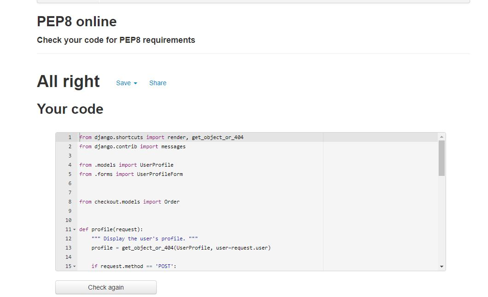

* [**Testing**](<#testing>)
* [**Manual Testing**](<#manual-testing>)
* [**Bugs**](<#bugs>)
* [**Accessibility**](<#accessibilty>)
# Testing
W3C markup validator and W3C CSS validator were used to test and validate all the code on all 4  pages of history quiz to ensure that there were no syntax errors. JS hint was used to test the Javascrpit and PEP8 online checker for python errors.

 # index
The image below is testing for the index.html file, only javascript causing warnings. 

 # Products on all related pages
The image below is testing for the Products on all related pages only, javascript causing warnings.

 #  Shopping Bag
The image below is testing for the bag page, javascript causing warnings.

 # checkout
 The image below is testing for the checkout page, javascript causing warnings.
 The error is due to django crispy forms being used.

# Product Management
 The image below is testing for the product management page ,javascript causing warnings. 

# Profiles
 The image below is testing for the Score.html file. No errors or warnings are visible. 

# CSS testing for all pages on base css

# PEP8 Testing 
No issues found Materialize all code works.

![Testing on PEP8 Html]

# PEP8 Testing 
Testing on Pep8 shopping bag

Testing on Pep8 checkout_forms

Testing on Pep8 checkout models

Testing on Pep8 checkout signals

Testing on Pep8 checkout views

Testing on Pep8 wishlist models

Testing on Pep8 wishlist views

[Testing on Pep8 wishlist views

Testing on Pep8 product models

Testing on Pep8 profile forms

Testing on Pep8 profile models

Testing on Pep8 profile views

# Automated Testing
I would have liked to do more on this put due my limited understanding on this and very little coverage on this subject on the LMS i have only managed to incorporate 3 functioning test.

# Build vs  Deployment 
| Test Build Vs Deployed Build                                         | Build Version                             | Deployed version       | Pass  | Errors   |
|----------------------------------------------------------------------|-------------------------------------------|------------------------|-------|----------|
| Nav Bar Functionality working correctly                              | No Issues                                 | Matches build version  | pass  | n/a      |
| Drop down menus                                                      | No Issues                                 | Matches build version  | pass  | n/a      |
| Search Bar functions                                                 | Working correctly                         | Matches build version  | pass  | n/a      |
| All links working on dropdown menus                                  | Working Correctly                         | Matches build version  | pass  | n/a      |
| Shop now button                                                      | Working Correctly                         | Matches build version  | pass  | n/a      |
| Product pages  card borders                                          | Appearing as intended                     | Matches build version  | pass  | n/a      |
| Free delivery banner text and background color                       | Appearing as intended                     | Matches build version  | pass  | n/a      |
| Image and text links taking you product details page                 | Appearing as intended                     | Matches build version  | pass  | n/a      |
| Edit and delete buttons appear on for admin only                     | Appearing as intended                     | Matches build version  | pass  | n/a      |
| Sort a list of items. By price, alphabetically, rating, and category | Appearing as intended                     | Matches build version  | pass  | n/a      |
| Order confirmation including what the user has bought                | Appearing as intended                     | Matches build version  | pass  | n/a      |
| User profile and personal information                                | Working Correctly                         | Matches build version  | pass  | n/a      |
| To be able to enter payment details to purchase items                | Working Correctly                         | Matches build version  | pass  | n/a      |
| Add products from an admin for on the website                        | Working Correctly                         | Matches build version  | pass  | n/a      |
| Quantity buttons resizing on different devices                       | Not working correctly on smaller devices  | Matches build version  | fail  | Resizing |
| Checkout pages and buttons working correctly                         | Working Correctly                         | Matches build version  | pass  | n/a      |
| Email Verification sent                                              | Working Correctly                         | Matches build version  | pass  | n/a      |
| Order history appearing on profiles pages                            | Working Correctly                         | Matches build version  | pass  | n/a      |
| Products appear on wish list once selected                           | Working Correctly                         | Matches build version  | pass  | n/a      |

### User Feedback vs Deployment  
| User Stories Vs deployed version                                | Achieved | Fail |
|-----------------------------------------------------------------|----------|------|
| All products have detailed description                          | Pass     | n/a  |
| The amount of products displayed on the page                    | Pass     | n/a  |
| Easy user interface                                             | Pass     | n/a  |
| Search bar                                                      | Pass     | n/a  |
| All available products in separate categories                   | Pass     | n/a  |
| Order conformation                                              | Pass     | n/a  |
| Secure site with card payment                                   | Pass     | n/a  |
| User profile with order history                                 | Pass     | n/a  |
| Login and registration features available                       | Pass     | n/a  |
| Password recovery                                               | Pass     | n/a  |
| Images and text have links to the product description           | Pass     | n/a  |
| Product form to edit and delete product inventory.              | Pass     | n/a  |
| Admin access to view all customers that use Eshop               | Pass     | n/a  |
| A feature to save personal information and delivery information | Pass     | n/a  |

### Responsiveness Testing 

# BUGS
 

  1..
  2. 
  3. 

# Accessibility

